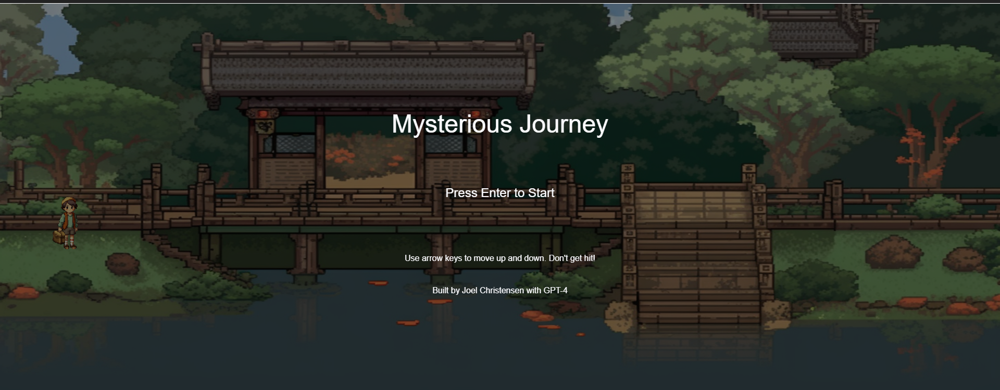

# Mysterious Journey

Built in a couple of hours with GPT-4, Mysterious Journey is a simple 2D scrolling game built using JavaScript and HTML5 Canvas. The player controls an avatar, navigating through an endless stream of obstacles, with the goal of surviving as long as possible.

## How to Play

1. Clone this repository or download the files.
2. Open `index.html` in your preferred web browser.
3. Press the `Enter` key to start the game.
4. Use the `Arrow Up` and `Arrow Down` keys to move the player avatar up and down.
5. Avoid colliding with the obstacles to survive as long as possible.
